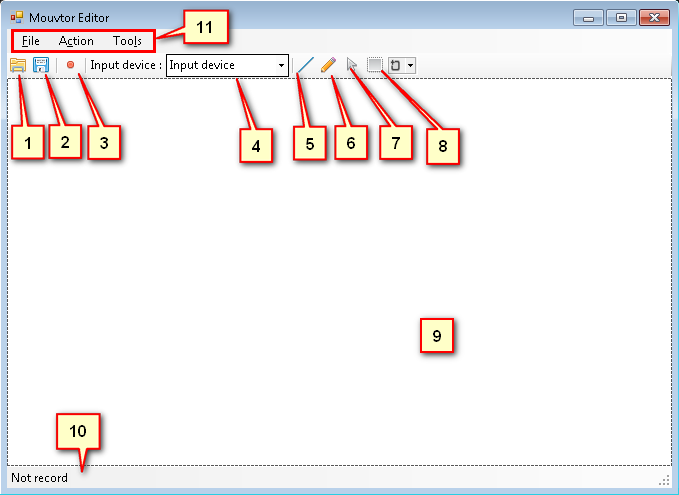
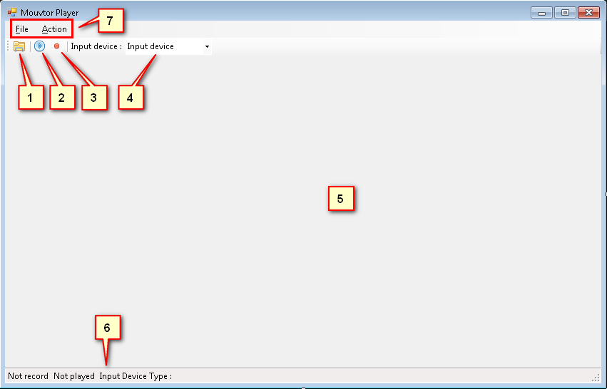
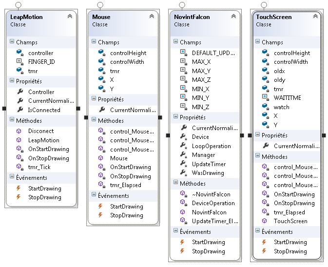
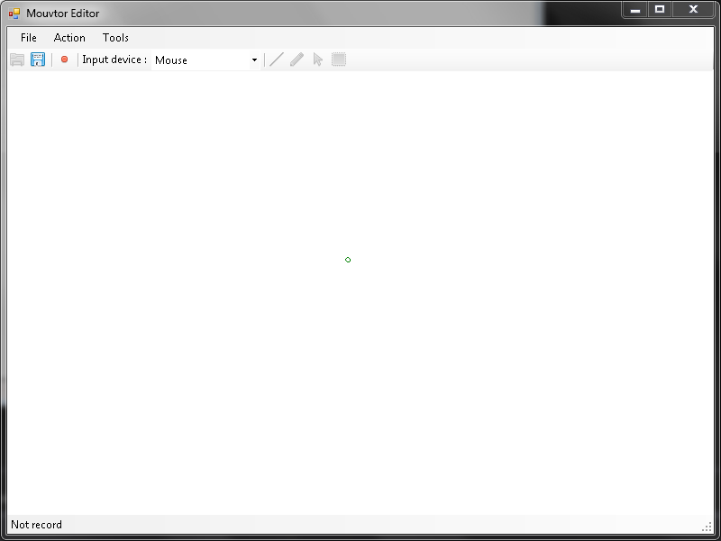

# Mouvtor

## Introduction

### Contexte

Dans le cadre de la formation de Technicien ES en informatique au CFPT, nous avons effectué des projets de groupe mélangeant les élèves de première et de deuxième année. Ce document décrit le projet _Mouvtor_, réalisé par 2 élèves de première année et un élève de deuxième année.

## But du projet

Le but de ce projet est de concevoir une application permettant d'enregistrer tous types de mouvements en utilisant différents périphériques d'entrée. Ces mouvement peuvent ensuite être reproduits, et comparés au mouvement original.

Différents cas d'utilisation de ce programme sont envisageables, comme par exemple l'apprentissage d'un système d'écriture comme le mandarin en utilisant une tablette graphique, ou encore la rééducation de mouvements.

## Equipe

- Lucien Camuglia
- Alan Devaud
- Dimitri Lizzi

## Environnement

Différents périphériques sont à notre disposition au sein du CFPT :

- Un projecteur tactile de NCI lab (salle RI104)
- Leapmotion
- Souris
- Tablette graphique Cintiq
- Souris 3D Novint Falcon

## Travail à rendre

- Documentation
- Présentation
- Code source

## Planning

### 02.12.2015

- Présentation du sujet et planning
- Ouverture du git
- Réflexion sur la structure
- Esquisses de l'interface

### 09.12.2015

- création projet Visual Studio
- création interface
- classes de base pour la gestion des tracés
- classe générique pour la gestion des périphériques d'entrée

### 16.12.2015

- classe pour l'entrée à la souris
- interface d'enregistrement tracés

### 23.12.2015

- interface d'enregistrement tracés
- documentation du travail effectué
- classe pour Leapmotion

### 13.01.2016

- interface d'enregistrement des tracés
- interface de reproduction des tracés
- documentation

### 20.01.2016

- interface de reproduction des tracés
- classe pour tablette graphique
- classe pour leapmotion

### 27.01.2016

- interface de reproduction des tracés
- classe pour tablette graphique
- classe pour leapmotion

### 03.02.2016

- interface de reproduction des tracés
- classe pour tablette graphique
- classe pour souris 3D

### 10.02.2016

- classe pour souris 3D
- interface de reproduction des tracés
- documentation

### 24.02.2016

- classe pour souris 3D
- interface de reproduction des tracés
- documentation

### 02.03.2015

- documentation
- "gel" du code

### 09.03.2015

- documentation
- préparation présentation

### 16.03.2015

- mise en page et relecture de la documentation
- préparation présentation
- rendu du projet

### 23.03.2015

- présentation du projet

## Structure de l'application

Deux vues:

- Une application d'enregistrement de tracés
    + Bouton de début d'enregistrement
    + Bouton de fin d'enregistrement
    + Sauvegarde du tracé dans un fichier
    + Ouverture d'un tracé depuis un fichier
    + Outils de dessin du tracé
        * Ligne droite
        * Libre
    + Outils de sélection (bonus si le temps le permet)
        * Souris
        * Zone
    + Zone de dessin
- Une application de reproduction de tracés
    + Ouverture d'un fichier de tracé
    + Affichage du tracé demandé
    + Enregistrement du tracé de l'utilisateur et évalution de la similarité avec le tracé original

Un tracé est une liste de points qui ont: 

- une coordonée (X, Y)
- un taux de pression (Z)
- un temps (millisecondes depuis le début du tracé)

##Arborescence des dossiers
```
──mouvtor
  ├───Documentation
  │   ├───Documentation.md
  │   ├───documentation.pdf
  │   └───Images
  ├───POC
  │   ├───LeapMotion
  │   ├───Mouse
  │   └───TouchScreen
  └───Project
      └───Mouvtor
          ├───InputDevices
	      │   ├──LeapMotion.cs
	      │   ├──Mouse.cs
	      │   ├──NovintFalcon.cs
	      │   └──TouchScreen.cs
	      │
          ├───MouvtorCommon
	      │   ├──DrawingZone.cs   
	      │   ├──IInputDevice.cs
	      │   ├──Line.cs
	      │   ├──MouvmlReader.cs
	      │   ├──MouvmlWriter.cs 
	      │   ├──Path.cs
	      │   ├──PathStep.cs
	      │   └──Point3DNormalized.cs
	      │		 
          ├───MouvtorEditor
	      │   └FrmMouvtor.cs
	      │
          └───MouvtorPlayer  
	          └FrmMouvtorPlayer.cs
         
```


##Fenêtres
###Editeur


1. Ouvrir un fichier contenant les tracés 
2. Sauvegarder les tracés dans un fichier
3. Enregistre le schéma
4. Choix du type d'entrée 
 - Souris
 - Souris 3D
 - Leap Motion
 - Ecran tactile
5. Tracer un trait droit
6. Dessin libre
7. Curseur pour faire des modifications du tracé
8. outil de sélection
9. Zone de dessin
10. Barre de statut
11. Regroupement de tous les outils cité ci-dessus

###Player


1. Ouvrir un fichier contenant les tracés 
2. Voir l'animation du tracé
3. Enregistre le schéma
4. Choix du type d'entrée 
 - Souris
 - Souris 3D
 - Leap Motion
 - Ecran tactile
5. Zone de dessin
6. Barre de statut
7. Regroupement de tous les outils cité ci-dessus


## Fonctionnement de l'application

### Enregistrement et chargement de chemins

L'application étant partagée en deux parties, l'éditeur et le lecteur, il a fallu définir un format de fichier permettant d'exporter des dessins depuis l'éditeur et de le importer dans le lecteur. Ce format est basé sur _XML_[^XML] et est inspiré du format _SVG_[^SVG]. Il n'est cependant pas intercompatible avec ce dernier. Ce format a été baptisé _MouvML_, pour _Mouvtor Markup Language_.

Les sections suivantes décrivent les différentes balises présentes dans un fichier _MouvML_.

[^XML]:  _Extensible Markup Language_, un format standard de fichier permettant de stocker des informations de manière hiérarchique. 

[^SVG]: _Simple Vector Graphics_, un format standard permettant de décrire des images vectorielles.

#### Balises d'un fichier _MouvML_ 

_MouvML_ étant basé sur _XML_ Un fichier _MouvML_ contient 3 sortes de balises, décrites dans les sections ci-dessous.

##### Doctype

Comme tout fichier _XML_, la première ligne du fichier contient un _doctype_. Cette balise informe sur la version du standard _XML_ utilisé et l'encodage utilisé. _MouvML_ est basé sur la version 1.0 du standard _XML_. L'encodage utilisé pour les fichiers est _UTF-8_. 

Le _doctype_ d'un fichier _MouvML_ doit donc être identique à la ligne suivante:

```xml
<?xml version="1.0" encoding="utf-8"?>
```

##### La balise `mouvml` 

Cette balise est la balise parente, qui englobe toutes les autres balises du fichier.  Elle doit __impérativement__ être définie au début du fichier, juste après le _doctype_.  Les enfants de cette balise sont des balises `path`.

Voici un exemple de balise `mouvml`:

```xml
<mouvml version="0.1">
    <!-- Les différents chemins du dessin sont définis ici -->
</mouvml>
```

Cette balise possède les propriétés suivantes:

| Nom | Obligatoire | Description | Exemple |
|-----|-------------|-------------|---------|
| `version` | oui | La version du format MouvML. La version actuelle est la version 1.0. Si le format MouvML est modifié ultérieurement (par exemple, en ajoutant une nouvelle balise), ce numéro de version devra être incrémenté. Cela permettra à l'application d'être consciente de la version du fichier et d'être capable de gérer différentes versions du format MouvML. | `version="1.0"` |
|-----|-------------|-------------|---------|

##### Les balises `path`

Les balises `path` décrivent un chemin, c'est à dire une ligne tracée par l'utilisateur. Ces balises doivent être des enfants directs de la balise `mouvml`.  Cette balise contient différentes balises `point` qui décrivent chaque point du chemin. Les balises `point` sont décrites dans la section suivante.

Voici un exemple de balise `path` :

```xml
<path timestamp="3537">
    <!-- Les différents points du chemin sont définis ici -->
</path>
```

Les balises `path` possèdent les propriétés suivantes:

| Nom | Obligatoire | Description | Exemple |
|-----|-------------|-------------|---------|
| `timestamp` | Oui | Temps à partir duquel le dessin de ce chemin doit être commencé, en millisecondes depuis le début du dessin. | `timestamp="1337"`
|-----|-------------|-------------|---------|

##### Les balises  `point`

Les balises `point` décrivent un point à l'intérieur d'un chemin, défini par les coordonnées et la pression du point ainsi que le moment auquel ce point doit être dessiné. . Ces balises doivent être des enfants directs d'une balise `path`. Les coordonnées définies dans une balise `point` sont _relatives_ et non _absolues_, ce qui permet de rendre un chemin indépendant de la taille de la zone de dessin et du périphérique de dessin utilisé.

Voici un exemple de balise `point` :

```xml
<point x="0.1337" y="0.42" z="0.9" timestamp="0" />
```

Les balises `point` possèdent les propriétés suivantes:

| Nom | Obligatoire | Description | Exemple |
|-----|-------------|-------------|---------|
| `x` | Oui | Position horizontale du point, comprise entre 0 (extrême gauche) et 1.0 (extrême droite).  | `x="0.002322"`
| `y` | Oui | Position verticale du point, comprise entre 0 (haut de l'image) et 1.0 (bas de l'image)| `y="0.239833"`|
| `z` | Oui | Profondeur du point, comprise entre 0 (profondeur minimale) et 1.0 (très profondeur maximale). La profondeur est représentée par l'épaisseur du trait dans l'application. | `z="0.999923"` |
| `timestamp` | Oui | Temps auquel ce point doit être dessiné, en millisecondes à partir du début du chemin parent. Ce temps est donc relatif au temps du chemin parent. | `timestamp="123"` |
|-----|-------------|-------------|---------|

#### Écriture d'un fichier MouvML

L'écriture d'un fichier _MouvML_ se fait à l'aide de la classe `MouvmlWriter` qui est définie dans le projet _MouvtorCommon_. Cette classe permet de sauvegarder des chemins dans un fichier _MouvML_. 

Un chemin est défini dans l'application comme un objet de type `Path`. Il sera traduit en une balise `path` pendant l'export en fichier _MouvML_. Ce dernier est une liste spécialisée d'objets `PathStep`.

Un objet `PathStep` représente un point d'un chemin. Il sera traduit en une balise `point` pendant l'export en fichier _MouvML_.

La classe `MouvmlWriter` doit être instanciée avec comme paramètre le nom du fichier _MouvML_ où seront sauvegardées les données.  On peut ensuite définir les objets `Path` à sauvegarder grâce aux méthodes `AddPath` et `AddPaths` de `MouvmlWriter`.  On appelle ensuite la méthode `Save` pour générer le fichier.

Voici un exemple d'utilisation de la classe `MouvmlWriter`:

```csharp
// un chemin que l'on souhaite sauvegarder
var unChemin = new Path(timestamp: 123)
{
    new PathStep(x: 0.2, y: 0.2, z: 1.0, timestamp: 0),
    new PathStep(x: 0.8, y: 0.2, z: 1.0, timestamp: 500),
    new PathStep(x: 0.8, y: 0.8, z: 1.0, timestamp: 1000),
    new PathStep(x: 0.2, y: 0.8, z: 1.0, timestamp: 1500),
    new PathStep(x: 0.2, y: 0.2, z: 1.0, timestamp: 2000),
};

// une collection de chemins que l'on souhaite aussi sauvegarder
var desChemins = new List<Path> {
    new Path(timestamp: 3000)
    {
        new PathStep(x: 0.3, y: 0.7, z: 0.2, timestamp: 0),
        new PathStep(x: 0.5, y: 0.2, z: 0.3, timestamp: 500)
    },
    new Path(timestamp: 4500)
    {      
        new PathStep(x: 0.0, y: 0.0, z: 0.5, timestamp: 0),
        new PathStep(x: 1.0, y: 1.0, z: 0.5, timestamp: 500)
    }
};

// Création d'un "writer" pour un fichier
var writer = new MouvmlWriter("unfichier.mouvml");

// Ajout d'un chemin
writer.AddPath(unChemin);

// Ajout de plusieurs chemins
writer.AddPaths(desChemins);

// Sauvegarde du fichier
writer.Save();
```
Le code ci-dessus générera le fichier suivant, nommé `unfichier.mouvml` :

```xml
<?xml version="1.0" encoding="utf-8"?>
<mouvml version="0.1">
  <path timestamp="123">
    <point x="0.2" y="0.2" z="1" timestamp="0" />
    <point x="0.8" y="0.2" z="1" timestamp="500" />
    <point x="0.8" y="0.8" z="1" timestamp="1000" />
    <point x="0.2" y="0.8" z="1" timestamp="1500" />
    <point x="0.2" y="0.2" z="1" timestamp="2000" />
  </path>
  <path timestamp="3000">
    <point x="0.3" y="0.7" z="0.2" timestamp="0" />
    <point x="0.5" y="0.2" z="0.3" timestamp="500" />
  </path>
  <path timestamp="4500">
    <point x="0" y="0" z="0.5" timestamp="0" />
    <point x="1" y="1" z="0.5" timestamp="500" />
  </path>
</mouvml>
```

#### Lecture d'un fichier _MouvML_

La lecture d'un fichier _MouvML_ s'effectue grâce à la classe `MouvmlReader`. Son utilisation est très simple: on crée une instance de `MouvmlReader` avec le nom du fichier à lire en paramètre du constructeur.  Cet objet est alors utilisable comme une énumération de chemins, c'est à dire un `IEnumerable<Path>`. Si le fichier spécifié n'est pas lisible, une exception de type `FileNotFoundException` sera lancée.

Le code source ci-dessous donne un exemple de lecture d'un chemin:

```csharp
try
{
    // On fabrique un reader pour le fichier "unfichier.mouvml".
    // Cette ligne peut provoquer une FileNotFoundException
    var reader = new MouvmlReader("unfichier.mouvml");

    // On peut itérer les chemins contenus dans le fichier
    foreach (Path path in reader)
    {
        // On fait quelque chose avec le chemin
    }
}
catch (FileNotFoundException ex)
{
    Debug.WriteLine("Le fichier {0} est introuvable.", ex.FileName);
}
```

### Périphériques d'entrée

La classe `InputDevices` permet de gérer les différents périphérique d'entrée :
   - Souris
   - Souris 3D
   - Leap Motion
   - Ecran tactile

Elle est constituée d'une propriétée et de deux événements.

La propriétéé CurrentNormalizedPosition permet d'avoir la position du périphérique en X,Y et Z.

L'événement StartDrawing permet d'effectuer une action lorsque le périphérique est prêt à déssiner.

L'événement StopDrawing permet d'effectuer une action lorsque le périphérique ne peut pas dessiner.

#### Souris

La classe `Mouse` est constituée de 4 méthodes dont un timer.

La méthode `control_MouseUp` est activée lorsque l'utilisateur relâche le clique de la souris. Elle appelle l'événement "StopDrawing".

La méthode `control_MouseDown` est activée lorsque l'utilisateur appuye sur le clique de la souris. Elle appelle l'événement "StartDrawing".

La méthode `control_MouseMove` est activée lorsque l'utilisateur bouge la souris. Elle sauvegarde la position X et Y de la souris.

Le méthode `tmr_Elapsed` est le timer, il s'éxécute toute les millisecondes. Il sauvegarde les position normalisée de la souris dans la propriétée `CurrentNormalizedPosition`.

#### Souris 3D

La classe classe `NovintFalcon` est constituée de 2 méthodes dont un timer. 

La méthode `UpdateTimer_Elapsed` est le timer. Elle s'exécute toutes les millisecondes. Elle met à jour la position X, Y, Z du périphérique. Cette méthode émet un événement `StartDrawing` si l'utilisateur vient d'appuyer sur le bouton central du périphérique et un événement `StopDrawing` si l'utilisateur vient d'arrêter d'appuyer.

La seconde méthode, `DeviceOperation`, est appelée périodiquement par le périphérique à chaque update et va forcer le retour haptique à rester au même niveau.

La bibliothèque [SharpFalcon](https://github.com/hapm/SharpFalcon) a été utilisée pour communiquer avec le périphérique. Pour l'utiliser, il ne faut pas oublier de rajouter les fichiers suivants au projet:

- hdal.ini
- hdl.dll
- dhdlc.dll
- dhdlcDriver.dll

Les drivers du périphérique doivent également avoir été installés sur la machine pour que le périphérique soit reconnu.

#### Leap Motion

La classe `LeapMotion` est constituée de 2 méthodes dont un timer.

La méthode `tmr_Tick` est le timer, il s'éxécute toutes les millisecondes.
Il vérifie que le leap motion est connecté.
Ensuite il vérifie que l'utilisateur montre sont index et qu'il est tendu. Si c'est le cas, il sauvegarde la position X,Y et Z du doigt dans la propriétée `CurrentNormalizedPosition` et déclache l'événement `StartDrawing`.
Si aucun doigt n'est détecté, l'événement `StopDrawing` est déclanché.

La méthode `Disconnect` arrête le timer et désactive le leap motion.

#### Ecran tactile

La classe `TouchScreen` est constituée de 4 méthodes dont un timer.

Elle ressemble beaucoup a `Mouse.cs` la seule différence est le timer, qui test si la position ne bouge plus pendant une seconde. Si c'est le cas, il appel l'événement `StopDrawing`.

Cette différence est obligatoire car la méthode `control_MouseUp` n'est pas forcément appelée lorsque le doigt de l'utilisateur est levé.


#### Diagrame de classes


### DrawingZone
#### Présentation

La _DrawingZone_ est le composant qui permet à l'utilisateur de dessiner son tracer. 
Ce composant est aussi bien utilisée dans l'éditeur que dans le player pour effectuer et afficher les tracers.



La _DrawingZone_ est le composant central de l'application

#### Codement parlant
##### Enumération
Un énumération a été créée pour pouvoir avec un type de _DrawingZone_. Nous avons deux choix qui s'offre dans cette énumération. `Editor` et `Player` sont les types de _DrawingZone_ possible. 
- **Editor** : Type pour la version éditeur.
- **Player** : Type pour la version _player_.

Elles sont définié lors de la création de la _DrawingZone_.


#### Héritage
La _DrawingZone_ est une classe héritée de `Panel` qui nous permet d'avoir accès aux éléments de base du panel et y implémenter nos propres méthodes et propriétés.

```csharp
public class DrawingZone : Panel
```

#### Propriétés
Dans la _DrawingZone_ nous avons implémentés les propriétés suivantes :

```csharp
public TypeDrawZone TypeDrawZone { get; set; }
private Line CurrentLine { get; set; }
public List<Line> Lines { get; private set; }
public bool IsDrawing { get; set; }
public Point3DNormalized CursorPosition { get; set; }
private Stopwatch Stopwatch
{
    get
    {
        if (_stopWatch == null)
        {
            _stopWatch = new Stopwatch();
            _stopWatch.Start();
        }
        return _stopWatch;
    }
    set
    {
        _stopWatch = value;
    }
}
```

- **TypeDrawZone** : Cette propriété contien le type de _DrawingZone_ que nous créons. Ce type permet de dire si le composant est appelé pour l'_editor_ ou pour le _player_.
- **CurrentLine** : C'est la propriété qui permet d'enregistrer la ligne qui est actuellement entraint d'être dessinée.
- **Lines** : Cette liste contient toutes les lignes qui ont étées tracées sur la _DrawingZone_.
- **IsDrawing** : Indique si l'utilisateur est actuellement entrain de tracer quelque chose sur la _DrawingZone_.
- **CursorPosition** : Position du curseur pour la représentation graphique d'un curseur virtuelle.
- **Stopwatch** : C'est le "chronomètre" qui permet de mesurer la durée d'un tracer.

#### Constructeurs
La class _DrawingZone_ est constitué de deux constructeurs dont un dédié.

Le constructeur dédié :
```csharp
public DrawingZone(TypeDrawZone type)
{
    DoubleBuffered = true;
    Lines = new List<Line>();
    this.TypeDrawZone = type;
    Resize += OnSizeChanged;
}
```

Se constructeur prend en paramètre le type de la _DrawingZone_. Il effectue également les initialisations nécessaire au bon fonctionnement de la _DrawingZone_ tels que l'activation du `DoubleBuffered`, la création de la liste de `Line`, du type de zone ainsi que de l'évènement _Resize_ avec `Resize += OnSizeChanged`.

Le constructeur par défaut est consitué de sort à qu'il appel le constructeur dédié avec une `TypeDrawZone` par défaut.
```csharp
public DrawingZone()
    : this(TypeDrawZone.Editor)
{

}
```

#### Méthodes
Comme dit auparavant, la class _DrawingZone_ est constitée de méthodes implémentées par nos soins.

- **OnSizeChanged** : Appelle la fonction `ChangeSize` de la class `Line` pour que les lignes d'adapte aux dimension de la fenêtre.
- **StartDrawing** : Méthode appelée lors du commencement d'un tracer. Il initialise  `IsDrawing` à `true` et `CurrentLine` avec le début d'une nouvelle ligne.
- **StopDrawing** : Méthode appelée lors de la fin d'un tracer. Elle remet les variables à leur valeur par défaut et ajoute la `CurrentLine` dans la liste de lignes.
- **AddPointDrawing** : Ajoute les point dessinés dans la `CurrentLine`.
- **Clear** : Réinitialize la liste de ligne et la `Stopwatch`.
- **OnPaint** : Méthode qui permet d'afficher les lignes à l'écran.
- **DrawCursor** : Dessine le curseur virtuel sur la fenêtre.

### Path
#### Présentation
_Path_ est une classe créée par nous qui enregistre tous les points qui constitue la tracer. Cette classe est héritée d'une liste de _PathStep_.

```csharp
public class Path : List<PathStep>
```

#### Propriétés
Dans _Path_ les propriétés suivante ont été implémentées :

```csharp
public long Timestamp {get;  private set;}
private int CheckedPoint { get; set; }
```

- **Timestamp** : Enregistre le temps du tracer.
- **CheckedPoint** : Enregistre le nombre de point déjà vérifié et que l'on doit garder.

#### Constructeurs
_Path_ est également constitué de deux constructeurs.

Le constructeur dédié :
```csharp
public Path(long timestamp)
{
    Timestamp = timestamp;
    this.CheckedPoint = 0;
}
```
Se constructeur à pour paramètre le **Timestamp** du tracer. De plus, il initialise le nombre de point vérifié à 0.

Le deuxième constructeur prend en compte un `IEnumerable` dans les paramètre :
```csharp
public Path(long timestamp, IEnumerable<PathStep> points)
    : this(timestamp)
{
    AddRange(points);
}
```
Ajoute le tracer dans le liste de la classe.

#### Méthodes
La classe _Path_ est constitué d'une méthode :

- **DeleteUselessPoint** : Cette méthode est celle qui fait le nettoyage dans la liste de _PathStep_.

Elle récupère un certain nombre de point à partir du dernier point vérifié jusqu'à la fin de la liste.

```csharp
for(int i = this.CheckedPoint + 1; i < this.Count - 1; ++i)
    removed.Add(this[i]);
```

Une fois les points récupérer on les supprimes de la liste.

```csharp
for (int i = 0; i < removed.Count; ++i)
    this.Remove(removed[i]);
```

Pour finir on augmente le nombre de point vérifié.

```csharp
this.CheckedPoint++;
```

### PathStep
#### Présentation
_PathStep_ est la classe qui enregistre un point avec son _Timestamp_. Elle est utilisée pour créer la liste de point utilisé dans un tracer.

#### Propriétés
_PathStep_ est constitué de deux propriétés :
```csharp
public Point3DNormalized NormalizedPosition { get; protected set; }
public long Timestamp { get; internal set; }
```

- **NormalizedPosition** : Contient la position normalisée du point
- **Timestamp** : Temps de passage sur le point.

#### Constructor
_PathStep_ n'échape pas à l'exception du double constructeur.

Le constructeur dédié :
```csharp
public PathStep(Point3DNormalized fromPoint, long timestamp)
{
    NormalizedPosition = fromPoint;
    Timestamp = timestamp;
}
```
Le constructeur dédié prend en compte un `Point3DNormalized` et un `timestamp`. Il enregistre ces deux paramètres dans les propriétés précédement créée et préparée à cette usage.

Le deuxième constructeur prend plus de paramètre :
```csharp
public PathStep(double x, double y, double z, long timestamp)
    : this(new Point3DNormalized(x, y, z), timestamp)
{ }
```
Il prend en compte la position x, y et z du point pour en créer un `Point3DNormalized`.


## Bilan

### Atteinte des objectifs

Les objectifs de l'application ont été atteints en partie. Nous avons réussi à gérer toute la partie nous permettant d'enregistrer des dessins et de les rejouer.

Nous n'avons cependant pas eu le temps d'intégrer une fonctionnalité cruciale à l'application: la possibilité pour l'utilisateur d'essayer de reproduire un dessin et de pouvoir comparer cette reproduction avec l'original.

Nous déplorons aussi de ne pas avoir eu le temps de gérer les tablettes graphiques.

### Difficultés rencontrées

L'implémentation du périphérique Novint Falcon a posé pas mal de soucis. En effet, la seule librairie officielle permettant d'inter-agir avec ce périphérique n'est disponible que dans le langage C++. Nous avons dans un premier temps utilisé un _wrapper_ de cette librairie initialement prévu pour le moteur de jeu Unity 3D. 

Ce dernier ne gérait malheureusement pas les boutons correctement donc nous avons tenté de créer notre propre wrapper en nous inspirant de celui que nous avions. Notre manque de connaissances sur l'interopérabilité entre C# et une DLL en développée en C++ nous a empêcher de mener à bien cette tâche.

Nous avons finalement découvert la librairie SharpFalcon qui nous a permi d'utiliser ce périphérique beaucoup plus simplement.

### Conclusion

Nous avons tous eu beaucoup de plaisir à participer à ce projet. Il a été très interessant d'apprendre à utiliser les différents périphériques d'entrée, et de travailler en parallèle sur l'intégration de périphériques différents grâce à une interface commune entre ces derniers que nous avions définie en début de projet. Le groupe avait une bonne dynamique et l'outil de gestion de révisions _git_ a rendu la collaboration triviale.

Malgré que le projet ne soit pas encore terminé, nous estimons que nous avons développé une bonne base qui mériterait d'être développée pendant les années à venir.